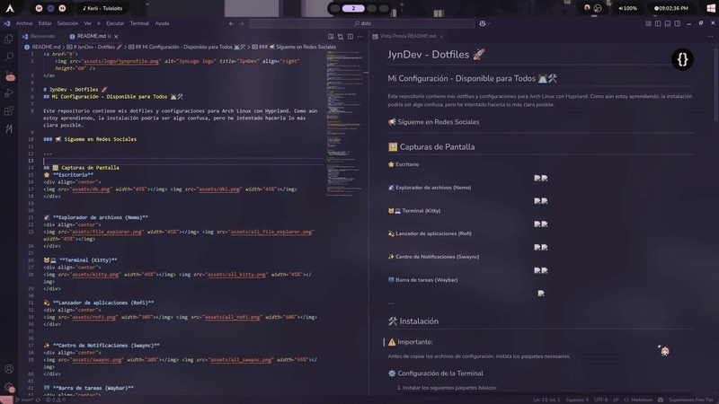
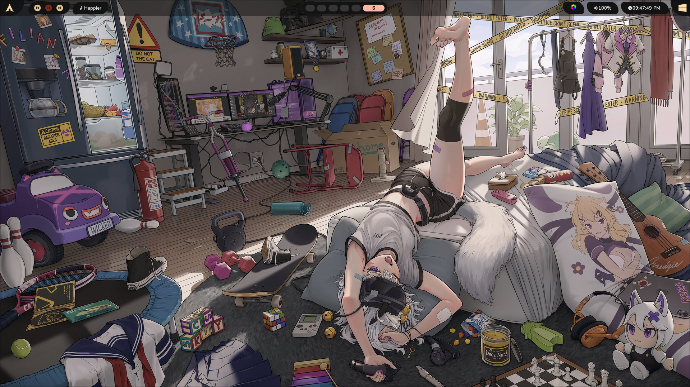
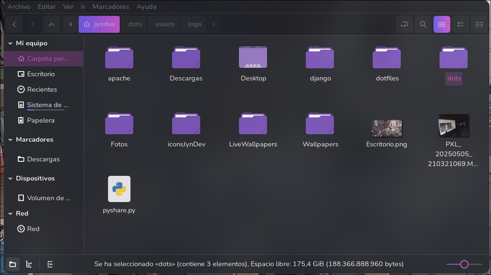
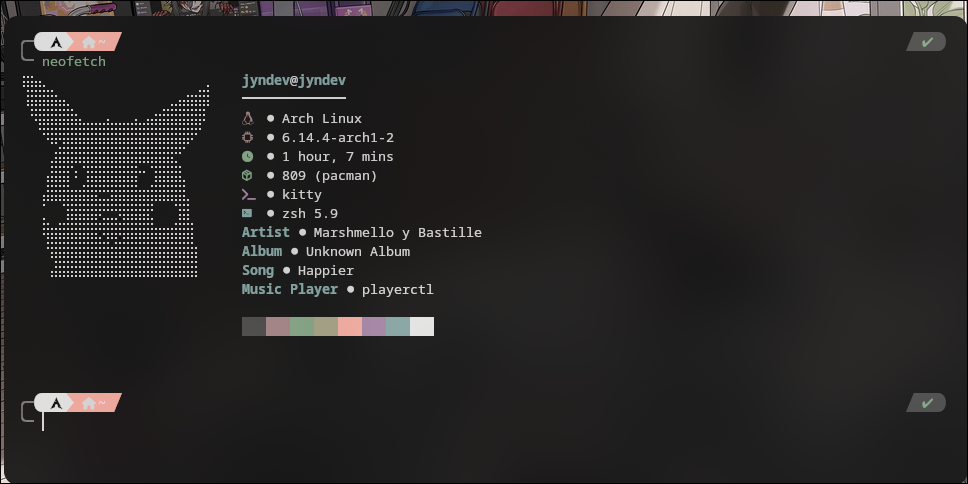
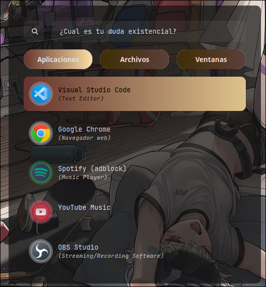
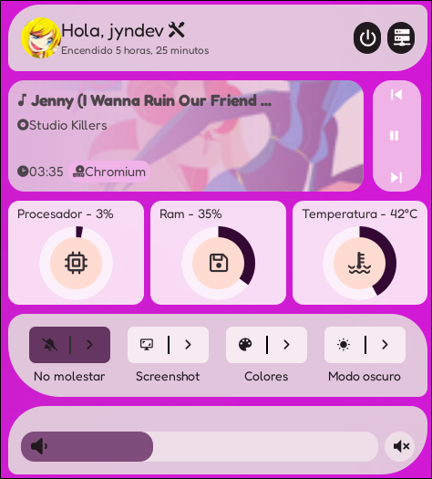
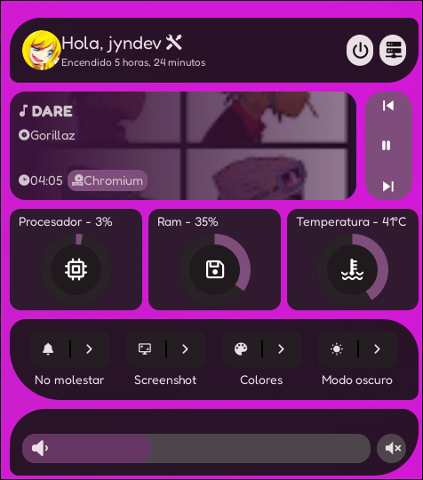
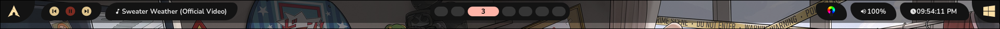

<h1 align="center">
  <br>
  <a href="https://www.tiktok.com/@jyndev"></a>
  <br>
  JynDev - Dotfiles 🐱
  <br>
</h1>

<p align="center">
  <i align="center">"No es solo un entorno, es tu reflejo. ¿Te animas a moldearlo? 💜" - Jyn</i>
  <br>
  Mis redes sociales:
  <br>
  <a href="https://www.tiktok.com/@jyndev">
       
   </a>
   <a href="https://discord.gg/Khkbk4FjsA">
          
   </a>
</p>

</img>


<a href="#">
    
</a>

# Dotfiles - Takanashi Version 🌠

### Aclaraciones iniciales 📢
Bienvenido a mi colección de **dotfiles** y configuraciones personalizadas para **Arch Linux** utilizando **Hyprland**.  
Este proyecto nace gracias al apoyo que he recibido en mi cuenta de TikTok. Nunca imaginé que mis configuraciones llegarían a tantas personas, ¡gracias por todo el apoyo!

> ⚠️ **Nota:** Esta es solo la **versión inicial**, por lo que aún puede contener errores o limitaciones. Continuaré mejorando y agregando nuevas funciones con el tiempo.

### 🛠️ Advertencia
No me hago responsable por posibles daños o inconvenientes que este repositorio pueda causar en tu sistema.  
Por favor, asegúrate de comprender lo que estás instalando o modificando antes de aplicar cualquier configuración.

### 💬 ¿Necesitas ayuda?

Si tienes dudas o algún problema con estas configuraciones, puedes escribirme por **mensaje privado en TikTok** para brindarte soporte o asistencia personalizada.

¡Espero que este repositorio te sea útil y te sirva como inspiración para crear tu propio entorno personalizado!.

---

<details>
<summary>
 Screenshots 📸
</summary> <br />

🌟 **Escritorio:**
</img>

🌠 **Explorador de archivos (Nemo)**
</img>

🐱‍💻 **Terminal (Kitty)**
</img>

💫 **Lanzador de aplicaciones (Rofi)**

</img>

✨ **Centro de Notificaciones (Eww)**
<div align="center">
</img> </img> 
</div>

🌃 **Barra de tareas (Waybar)**
<div align="center">
</img>
</img>
</div>
</details>


## 🛠️ Instalación

### ⚠️ Importante:

Antes de copiar los archivos de configuración, instala los paquetes necesarios.

### ⚠️ Elimina cualquier demonio o gestor de notificaciones que tengas instalados, esto por que estos archivos contienen su propio demonio de notificaciones.

### ⚙️ Configuración de la Terminal

1. Instalar los siguientes paquetes básicos:
   ```bash
   sudo pacman -S git zsh
   ```
2. Cambiar la shell por defecto:
   ```bash
   chsh -s /bin/zsh
   ```
3. Instalar **yay** (gestor de paquetes AUR):
   ```bash
   sudo pacman -S --needed base-devel && git clone https://aur.archlinux.org/yay.git && cd yay && makepkg -si
   ```
4. **🔃 Reinicia el sistema**
5. Instalar **Oh My ZSH** y configurar plugins (Buscalos y sigue su documentación para instalarlos):
   - **Plugins recomendados:**
     - `zsh-autosuggestions`
     - `zsh-syntax-highlighting`
     - `zsh-history-substring-search`
   - Edita el archivo `~/.zshrc` para agregarlos
   ```bash
   plugins=(git zsh-autosuggestions zsh-syntax-highlighting zsh-history-substring-search)
   ```
6. Instalar **Powerlevel10k** para mejorar el estilo de la terminal.

### 🏎️ Alias Útiles para `.zshrc`

```sh
alias install="sudo pacman -S"
alias aur_install="yay -S"
alias update="sudo pacman -Syu"
alias purge="sudo pacman -Rns"
```

## 🧰 Paquetes necesarios 

```bash
install gnome-tweaks swww fastfetch rofi-wayland nemo cinnamon-translations \
waybar ttf-jetbrains-mono-nerd zenity bc eog gnome-system-monitor evince \
xdg-desktop-portal-hyprland xdg-desktop-portal-gtk ffmpeg
```

```bash
aur_install hyprshot visual-studio-code-bin mpvpaper eww matugen-bin
```

### 🎵 Música

```bash
aur_install spotify # Instalar e iniciar sesión
aur_install spotify-adblock # Bloquear publicidad
```

---

## 🎨 Temas y Personalización

- 🏙️ **Iconos:** `Magna-Dark-Icons`
- 🖍️ **Tema GTK:** `Lavanda-gtk-theme`
- 🗚 **Fuente:** `Century Gothic`
- 🖱️ **Cursor:** `Anya-cursor-v3`

### 📄 Fuentes Adicionales (Japonés)

```bash
install noto-fonts-cjk
install noto-fonts-emoji
install noto-fonts
```

---

## ✅ Pasos Finales

1. Copia los archivos de `.config` a tu directorio `~/.config`.
2. Crea los siguientes directorios en `~/.cache/`:
   - `hyprlock` (Fondo de pantalla de bloqueo)
   - `albumart` (Imágenes de las canciones en reproducción)
   - `liveWallpaper` (Fondos de pantalla animados)

---

## ⚠️ Primer Arranque

Debes inicializar los colores de **pywal** para evitar errores al reiniciar:

```bash
matugen image "ruta_a_la_imagen"
```

---

## 🔒 Fondo de Pantalla en SDDM

El script de fondos de pantalla cambia dinámicamente el fondo de **SDDM**.

### Configuración

1. Ubicación del tema actual: `/usr/share/sddm/themes/sddm-astronaut-theme/Backgrounds`
2. Otorga permisos al directorio de configuración:
   ```bash
   sudo chmod 777 /usr/local/etc
   ```
3. Crea el directorio para SDDM:
   ```bash
   mkdir /usr/local/etc/sddm
   ```
4. Crea el enlace simbólico:
   ```bash
   sudo ln -s /usr/local/etc/sddm/sddm_background \
       /usr/share/sddm/themes/sddm-astronaut-theme/Backgrounds/background
   ```
5. Modifica la configuración del tema para usar el enlace simbólico:
   ```ini
   #################### Background ####################
   Background="Backgrounds/background"
   ```
6. **Ejecuta el script para cambiar el fondo de pantalla.**

---

## 🌎 Configuración de Aplicaciones con Wayland

Agrega estas opciones a los lanzadores de las aplicaciones para que reconozcan el tema GTK:

```bash
google-chrome-stable --ozone-platform=wayland
code --enable-features=WaylandWindowDecorations --ozone-platform=wayland
```

---

¡Listo! Ahora tu sistema debería estar completamente personalizado. 🚀
